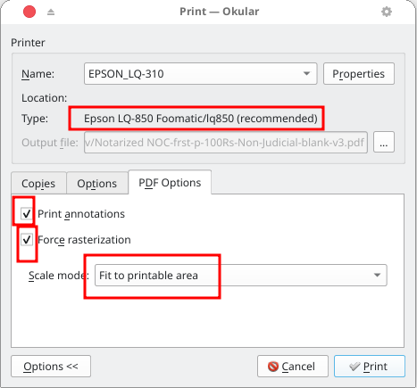
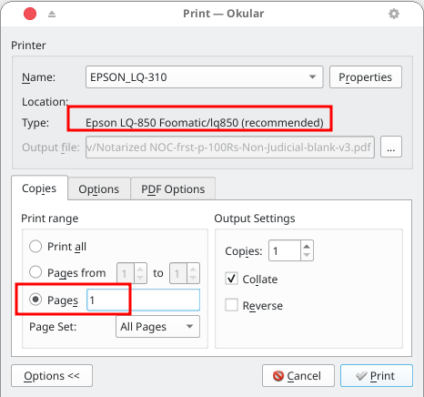
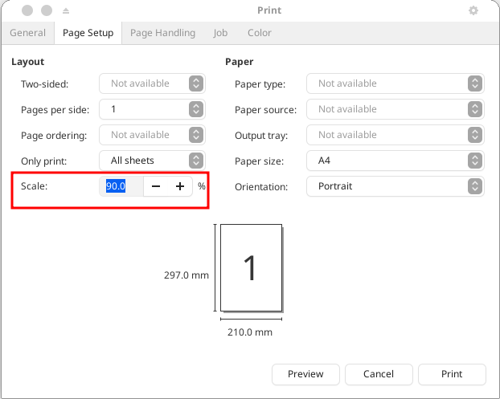
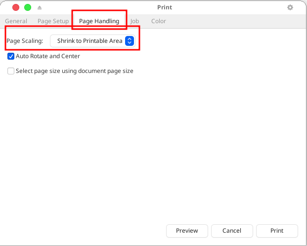

# Stamp Papers

I've found a workaround to deal with stamp papers. Get ready to stop by a photocopy shop just to duplicate the first page onto the stamp paper. You should use a PDF viewer called Okular (https://okular.kde.org/) to print the first page onto a more economical 55 - 70 GSM plain A4 sheet instead of printing it straight onto the stamp paper. After that, trim the printed text area from the plain paper made with your Epson Dot Matrix printer and stick the cut piece onto a new A4 sheet with a small amount of glue in the correct position. Keep in mind that stamp papers in India are nearly the same size as A4 paper, so you can use that to your advantage. Once that’s done, you can bring the first page to the photocopy shop to reproduce it on the actual stamp paper.

Verify the settings in Okular:

Atril PDF Viewer (https://github.com/mate-desktop/atril) can also be used to print the initial page. Choose a scaling level between 85% and 95% (**90%** should serve the purpose). Select the **Page Scaling** to **Shrink to Printable Area** from the **Page Handling** Tab. Try different settings until you get the desired result. The printed text area might not be where you want it to be, but since you will need to use glue and a paper knife, it is not that bad considering you will be able to keep a note of the precise settings, and you won't be destroying the actual stamp paper.

**Header and Footer:** A font size of **6 to 9** is appropriate for text in the header and footer sections, with **7** being the most common option. Text styles such as bold, italic, and underline are not recommended for use.

**One piece of advice:** Use papers from the same bunch. The photocopy will reflect any discrepancies in colour and texture.

# General Pages (A4 90 GSM Bond Paper)

Use the script `pdf-single-page-legal-a4.sh` along with the desktop entry `pdf-single-page-legal-a4.desktop` to print the remaining pages.
