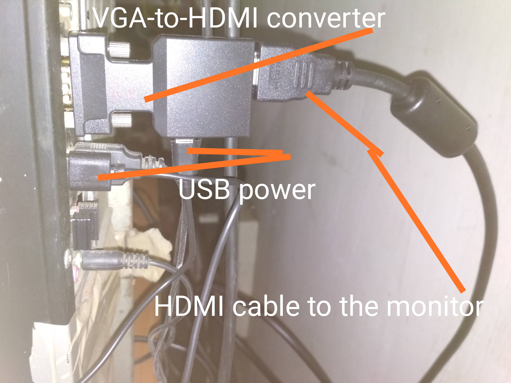
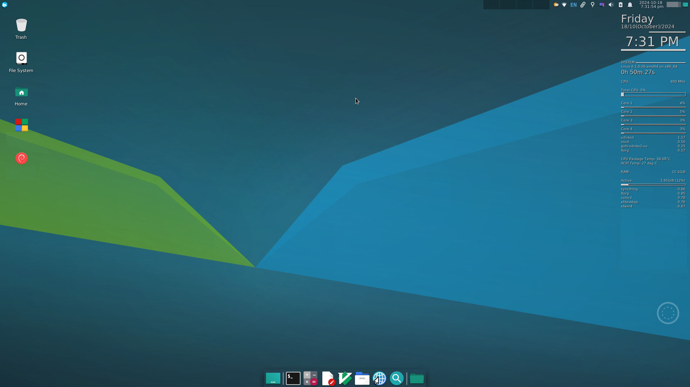

## FHD (1920x1080) through HDMI converter

Setting up the GNU+Linux system to use an external HDMI monitor which is connected to the system via a VGA-to-HDMI Signal Converter (VGA on the system's board and HDMI on the receiving end, that is, the FHD SAMSUNG display).

Platform: Debian XFCE with XORG.



Ref:

> https://askubuntu.com/questions/1075157/unable-to-set-my-screen-resolution-higher

> https://askubuntu.com/questions/1325057/cant-use-max-resolution-for-external-monitor-xrandr-configure-crtc-0-failed
> 
> > [so as codlord suggested, just using `cvt -r 2560 1440` instead of `cvt 2560 1440` fixed the issue.]

> https://askubuntu.com/questions/281509/how-do-i-change-the-screen-resolution-using-ubuntu-command-line

```bash
xrandr -q
```

The output was something like this:`Screen 0: minimum 320 x 200, current 1920 x 1080, maximum 16384 x 16384
VGA-1 connected 1............................`

```bash
cvt 1920 1080
```

Result:

```
# 1920x1080 59.96 Hz (CVT 2.07M9) hsync: 67.16 kHz; pclk: 173.00 MHz
Modeline "1920x1080_60.00"  173.00  1920 2048 2248 2576  1080 1083 1088 1120 -hsync +vsync
```

The failed steps:

```bash
sudo xrandr --newmode "1920x1080_60.00"  173.00  1920 2048 2248 2576  1080 1083 1088 1120 -hsync +vsync
```

```bash
sudo xrandr --addmode VGA-1 "1920x1080_60.00"
```

```bash
xrandr --output VGA-1 --mode 1920x1080_60.00
```

Output: `xrandr: Configure crtc 0 failed`

---

The plan-B:

```bash
cvt -r 1920 1080
```

Result:

```
# 1920x1080 59.93 Hz (CVT 2.07M9-R) hsync: 66.59 kHz; pclk: 138.50 MHz
Modeline "1920x1080R"  138.50  1920 1968 2000 2080  1080 1083 1088 1111 +hsync -vsync
```

Take note of everything after the word "Modeline".

Give your new resolution mode a name, e.g., `1920x1080R`. That was the name shown by the `cvt` command; so, use it.

```bash
sudo xrandr --newmode "1920x1080R"  138.50  1920 1968 2000 2080  1080 1083 1088 1111 +hsync -vsync
```

```bash
sudo xrandr --addmode VGA-1 "1920x1080R"
```

```bash
xrandr --output VGA-1 --mode 1920x1080R
```

Everything is okay now, except for the fact that you will lose the configuration after a reboot. The configuration has to be made persistent.

Double-check the result:

```bash
xrandr -q
```

Output:

```
Screen 0: minimum 320 x 200, current 1920 x 1080, maximum 16384 x 16384
VGA-1 connected 1920x1080+0+0 (normal left inverted right x axis y axis) 0mm x 0mm
   1024x768      60.00  
   800x600       60.32    56.25  
   848x480       60.00  
   640x480       59.94  
   1920x1080_60.00  59.96  
   1920x1080R    59.93* 
```

Persistent settings (for the next boot):

Create a bash shell file that does the work of changing the resolution for you:

```bash
touch ~/shell/fhd_res_desktop.sh
```

```bash
chmod +x ~/shell/fhd_res_desktop.sh
```

```bash
geany ~/shell/fhd_res_desktop.sh
```

Content:

```bash
#!/bin/bash

sudo xrandr --newmode "1920x1080R"  138.50  1920 1968 2000 2080  1080 1083 1088 1111 +hsync -vsync
sudo xrandr --addmode VGA-1 "1920x1080R"
xrandr --output VGA-1 --mode 1920x1080R
```

> [display - How do I save my new resolution setting with xrandr? - Ask Ubuntu](https://askubuntu.com/questions/754231/how-do-i-save-my-new-resolution-setting-with-xrandr)

```bash
sudo geany /etc/X11/xorg.conf
```

Paste the following block of code, save & close:

```
Section "Monitor"
    Identifier "VGA-1"
    Modeline   "1920x1080R"  138.50  1920 1968 2000 2080  1080 1083 1088 1111 +hsync -vsync
EndSection
```

Create  a desktop entry:

```bash
geany ~/.config/autostart/xrandr-settings.desktop
```

```bash
chmod +x ~/.config/autostart/xrandr-settings.desktop
```

Content:

```bash
[Desktop Entry]
Type=Application
Version=1.0
Name=custom xrandr settings

# Replace with your own xrandr command:
Exec=xrandr --output VGA-1 --mode 1920x1080R
```

At the moment, your system will retain the set resolution after a reboot. However, the XFCE DE and XORG somehow spoiled the look of the shadow of the top panel of the desktop. Maybe it was due to the theme I use, maybe something else. Regardless, I had to fix the issue.

> [tty - Restart xfce from tty1 - Ask Ubuntu](https://askubuntu.com/questions/215632/restart-xfce-from-tty1)

```bash
xfwm4 --replace
```

```bash
touch /home/YOURUSERNAME/shell/restart_XFCE_DESKTOP_GUI.sh
```

```bash
chmod +x /home/YOURUSERNAME/shell/restart_XFCE_DESKTOP_GUI.sh
```

```bash
geany /home/YOURUSERNAME/shell/restart_XFCE_DESKTOP_GUI.sh
```

```bash
#!/bin/bash

# https://askubuntu.com/questions/215632/restart-xfce-from-tty1
xfwm4 --replace && \
pkill conky
```

XFCE Whisker Menu -> Settings -> Session and Startup:

Delete all previous Conky settings that you had created before from startup.

Add the following entry:

---

Name: `restart-XFCE-DESKTOP-GUI`
Description: `Restart the XFCE desktop GUI`
Command: `sh /home/YOURUSERNAME/shell/restart_XFCE_DESKTOP_GUI.sh`
Trigger: `on login`

---

After booting up, run Conky manually.

Create a desktop entry:

```bash
touch ~/.local/share/applications/conky.desktop
```

```bash
chmod +x ~/.local/share/applications/conky.desktop
```

```bash
geany ~/.local/share/applications/conky.desktop
```

Content:

```bash
[Desktop Entry]

# Copyright Reserved by ArchWiki
# https://wiki.archlinux.org/title/Desktop_entries

# Source: https://wiki.archlinux.org/index.php/Desktop_entries
# An example of a desktop entry published by ArchWiki has been used here as
# a template. Copyright goes to the respective publisher which was originally
# published under GNU Free Documentation License 1.3.
# For more information, see https://www.gnu.org/copyleft/fdl.html.
# GNU Free Documentation License mandates the inclusion of the terms of the
# license to be visible to the end-user.

Type=Application

Name=conky

Comment=Desktop Gadget

# The executable of the application, possibly with arguments.
Exec=conky & -b ~/.conkyrc 

# The name of the icon that will be used to display this entry
Icon=desktop-effects

# Describes whether this application needs to be run in a terminal or not
Terminal=false

# Describes the categories in which this entry should be shown
Categories=;

GenericName=Desktop Gadget that reads from sensors
```

You will find my Conky config file in this repository if you want to use that.

---

Extras:

> [display - How do I save my new resolution setting with xrandr? - Ask Ubuntu](https://askubuntu.com/questions/754231/how-do-i-save-my-new-resolution-setting-with-xrandr)

Install two small utility packages:

```bash
yes | sudo apt install autorandr
```

And

```bash
yes | sudo apt install arandr
```

Store your configuration with `autorandr --save "SAVED_CONFIG_NAME_OF_YOUR_CHOICE"`.

For example:

```bash
autorandr --save FHD_SAMSUNG
```

Output: `Saved current configuration as profile 'FHD_SAMSUNG'`

Resume the config with `autorandr --change FHD_SAMSUNG` to choose config,
or just `autorandr --change` to have it infer your config from
your connected monitors.

Reboot the system to check whether everything is working as expected:

```bash
sudo reboot now
```

You may have to make minor adjustments depending on the output of `cvt` (specifically,  `cvt -r 1920 1080`) on your system. Mine was: `"1920x1080R" 138.50 1920 1968 2000 2080 1080 1083 1088 1111`.


