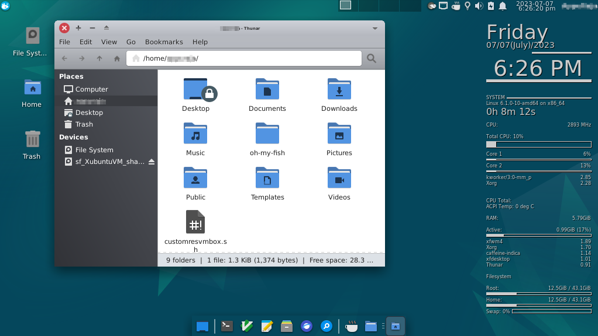
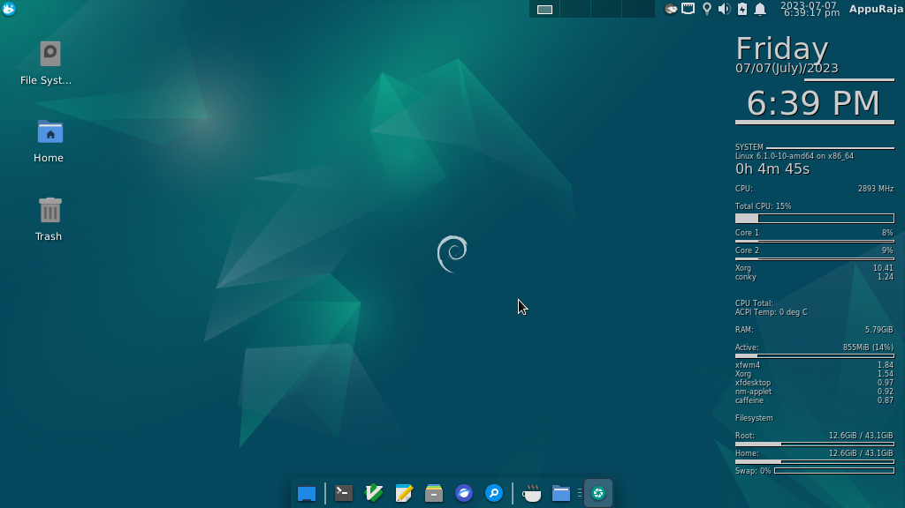
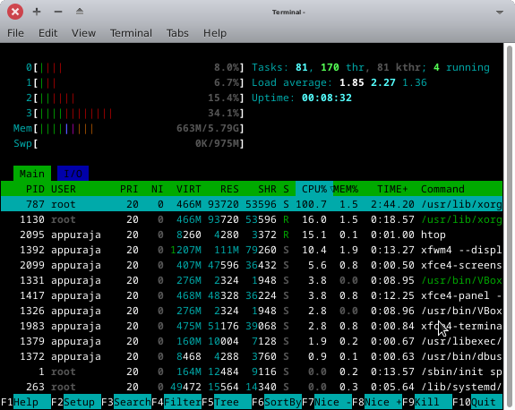
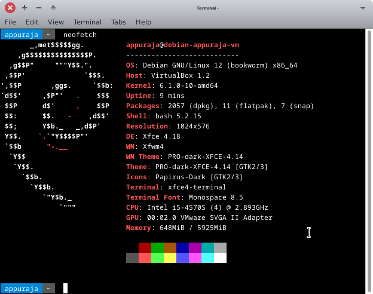
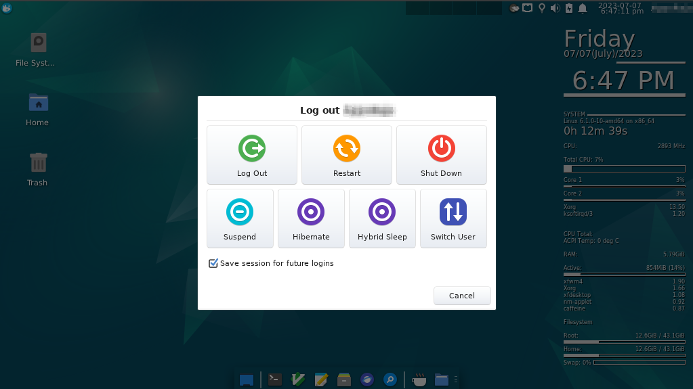

# Debian-minimal

Configure Debian and install only essential packages after installing the OS.

---

https://github.com/Pinaki82/Debian-minimal

---

[This repository](https://github.com/Pinaki82/Debian-minimal) draws inspiration from [Pinaki82](https://github.com/Pinaki82)'s [Xubuntu-minimum-shell-config](https://github.com/Pinaki82/Xubuntu-minimum-shell-config.git) repository on [GitHub](https://github.com).

## Table of Contents

- [Table of Contents](#table-of-contents)
- [Debian-minimal](#debian-minimal)
  - [What this repository is for?](#what-this-repository-is-for)
    - [Guides to:](#guides-to)
    - [Serves:](#serves)
  - [What this repository is not?](#what-this-repository-is-not)
- [Thou Shalt Not:](#thou-shalt-not)
  - [What you're allowed to do:](#what-youre-allowed-to-do)
- [How to Use instructions and scripts provided here:](#how-to-use-instructions-and-scripts-provided-here)
- [Alternative Software Search:](#alternative-software-search)
- [As a Mega-Bonus Offer for FREE, you'll find:](#as-a-mega-bonus-offer-for-free-youll-find)
- [How Does It Look Like?](#how-does-it-look-like)
- [Library PATHs in Linux](#library-paths-in-linux)
- [Installation and Configuration of "libsafec" Library](#installation-and-configuration-of-libsafec-Library)
- [Library PATH](#library-path)
- [Include (Header) files' PATH ](#include-Header-files-path)

## What this repository is for?

### Guides to:

- Install Debian-XFCE on a system.

- Install programs commonly used by most people.

- _Modify_ and _back up_ 'only one install script' that serves you forever. You'll get a workable installation.

### Serves:

Desktop Computer Users.

## What this repository is not?

- This repository doesn't aim to be a Debian-descendant distribution.

This repository was started as a backup to the config files I use on my Debian-XFCE system. Then, I decided to split the core parts from basic to minimal. Basic means, you'll need those packages and configurations as a starting point. Here, Minimal stands for, you'll find packages most people use. Now it is your responsibility to include/discard sections of the 'minimal' unit and keep a backup of your final version that you will use forever. Feel free to clone this repository as a starting point for your own desktop configuration.

# Thou Shalt Not:

- Ever try to install Ubuntu PPAs. Debian does not have a mechanism to recognise PPAs, and doing so may corrupt your system.

- Install DEB packages that are not meant for Debian and are only meant for Ubunu-descendant Linux distributions. These packages may not be compatible with your system and could cause problems.

- Enable backports unless absolutely necessary. Backports are packages that have been ported from a newer version of Debian to an older version. They can sometimes cause problems, so only enable them if you need a specific updated version of a package that is not available in the main Debian repositories. Even if you have enabled backports, do not install more than one or two apps from there, that too, never without thorough consideration.

- Run commands or scripts from unverified sources. These commands could contain malicious code that could damage your system. Every time you run a command you must try to understand what that does.

- Install more apps than you need. This can clutter your system and make it less stable.

- Install a GUI-Userspace app (like GIMP, Inkscape, Krita, or Blender) from the Debian repository. Instead, you must prefer AppImage, Snap and Flatpak over the default repository as long as it is feasible.

- Install GUI-Userspace apps (like GIMP, Inkscape, Krita, and Blender) from the Debian repository. These extra apps will clutter your system. Instead, use AppImage, Snap, or Flatpak, which are newer formats that are more stable and up-to-date. Choose these newer containerised packaging platforms over the default repository as long as it is feasible.

- Avoid reading the documentation found here, online, discussions found in online forums, doing a web search, asking an AI engine when in doubt, RTFM - Read The Friendly Man Page before taking any steps no matter how trivial the step is when you do not know the deal.

## What you're allowed to do: <a name="what-youre-allowed-to-do"></a>

You can do an `apt search` for a package from the command line. There's no harm in trying to install packages in Debian as `sudo apt install package-gtk` when that particular package is `package-gtk3` in Debian. The command will not find the package in Debian's repository and return an error message without installing anything. However, adding PPAs or installing packages meant exclusively for Ubuntu will certainly damage your installation.

Your best bet will be to find a similar package as:

`apt search package-you-have-seen-in-ubuntu-repository`

You'll get an overall view and find the right direction.

Remember that Debian and Ubuntu have different package repositories. One doesn't pull anything directly from another's repository. Especially, Debian pulls nothing from Ubuntu's repository. Do not try to mix them.

# How to Use instructions and scripts provided here:

**NOTE:** Please keep this GitHub page open in your phone's browser to look at commands until your system is ready to display TXT/PDF files.

======

Programs to Create Bootable USB Drives:

https://rufus.ie/en/ (Recommended for Microsoft Windows users)

https://etcher.balena.io/

Debian Homepage: https://www.debian.org/

Debian Non-Free Firmware:

https://cdimage.debian.org/images/unofficial/non-free/firmware/

Download Debian (Recommended):

https://www.debian.org/download

_debian-xx.x.x-amd64-netinst.iso_

Debian Live Images:

Ref: https://unix.stackexchange.com/questions/307251/is-there-a-try-debian-without-install-option

Download: https://www.debian.org/CD/live/

Debian-12-bookworm firmware:

https://cdimage.debian.org/images/unofficial/non-free/firmware/bookworm/12.0.0/

File: `firmware.zip`

A Basic Guide:

https://phoenixnap.com/kb/how-to-install-debian-10-buster

Troubleshoot Blank Screen after crossing the GRUB Menu section:

https://forums.debian.net/viewtopic.php?t=63844

Press `e` when the GRUB appears.

Find the line containing `ro quiet` or `quiet`.

Add/Type the following commands to the end of the line,

`splash nomodeset`

`CTRL`+`x` [NOTE: On VirtualBox, use the Soft Keyboard from the menu bar.]

Once you enter the desktop:

Add the current user to **sudoers**:

`su`

`sudo su root`

`sudo nano /etc/sudoers`

Find the section:

```bash
#User privilege specification
root  ALL=(ALL:ALL) ALL
```

Then, add your username there as described below (`yourusername ALL=(ALL: ALL) ALL`).

```bash
#User privilege specification
root  ALL=(ALL:ALL) ALL
yourusername ALL=(ALL: ALL) ALL
```

Reboot the system.

`sudo reboot now`

Add the current user to **sudoers** again by doing:

`sudo usermod -aG sudo $(whoami)`

Edit the GRUB Bootloader:

Ref: https://unix.stackexchange.com/questions/538562/how-do-i-edit-grub-cfg-and-save-it

`sudo nano /etc/default/grub`

Find the line containing `ro quiet` or `quiet`

Add the following in the same line

`splash nomodeset`

Update the GRUB Bootloader:

`sudo update-grub`

`sudo update-grub2`

Troublshoot: https://serverfault.com/questions/717725/journalctl-access-for-non-root-users

```
Hint: You are currently not seeing messages from other users and the system.
      Users in groups 'adm', 'systemd-journal' can see all messages.
      Pass -q to turn off this notice.
```

`sudo usermod -a -G systemd-journal $(whoami)`

Reboot:

`sudo reboot now`

Update the system:

`yes | sudo apt update && sudo apt upgrade`

======

- Now, read the text file `00_debian-fresh-install.txt`.
  You'll know when to look at specific files.

- Next, read the script `01_debian_essential.sh` before running it. The script is about installing basic dependency/userspace packages that you usually expect from a computer or you'll need later.

Change the permission of the script before executing the script [Give it permission to execute].

```bssh
chmod +x 01_debian_essential.sh
```

To Run:

```bssh
./01_debian_essential.sh
```

- Come back to the primary instruction file `00_debian-fresh-install.txt`. Simply, read it without doing anything.

- When you come to see that the instruction tells you to READ/MODIFY/RUN the final script `02_debian_minimal_packages.sh`, do that and then come back again to the instruction file `00_debian-fresh-install.txt`.

```bssh
chmod +x 02_debian_minimal_packages.sh
```

```bssh
./02_debian_minimal_packages.sh
```

- Read the files in the folder 'shell' to get an overview of more packages.

- Look at other folders given here for desktop/app/system configurations.

# Alternative Software Search:

1. [switching.software](https://switching.software/)
   
   > (Git repository link to _switching.software_: https://codeberg.org/swiso/website)

2. [AlternativeTo](https://alternativeto.net/)

# As a Mega-Bonus Offer for FREE, you'll find: <a name="as-a-mega-bonus-offer-for-free-youll-find"></a>

- Some essential MS Windows configurations.

- Suggestions for truly cross-platform alternative software in practical terms.

- Most applications are curated to work on MS Windows for an uncompromising cross-platform experience.

# How Does It Look Like?











# Library PATHs in Linux

# Installation and Configuration of "libsafec" Library <a name="installation-and-configuration-of-libsafec-Library"></a>

[GitHub - rurban/safeclib: safec libc extension with all C11 Annex K functions](https://github.com/rurban/safeclib.git)

## Step 1: Remove the Previous Installation

```bash
sudo apt purge --auto-remove libsafec-dev
```

## Step 2: Clone the "safeclib" Repository

```bash
cd ~/
git clone https://github.com/rurban/safeclib.git
cd safeclib/
```

## Step 3: Build and Configure the Library

```bash
./build-aux/autogen.sh
./configure
```

## Step 4: Compile the Library

```bash
make
```

## Step 5: Install the Library

```bash
sudo make install
```

## Step 6: Update Library Cache

```bash
sudo ldconfig
```

## Step 7: Set Library Path (Temporary)

```bash
export LD_LIBRARY_PATH="/usr/local/lib:$LD_LIBRARY_PATH"
```

```bash
vim .bash_aliases
```

Add:

```bash
export LD_LIBRARY_PATH="/usr/local/lib:$LD_LIBRARY_PATH"
```

## Step 8: Source Configuration Files

```bash
source .bash_aliases
source .bashrc
```

## Step 9: Compile & Run the Program

```bash
gcc -o safeclib_example safeclib_example.c -L/usr/local/lib -lsafec
```

Or,

```bash
gcc -Wall -Wextra -pedantic safeclib_example.c -o safeclib_example -L/usr/local/lib -lsafec
```

```bash
chmod +x safeclib_example
```

```bash
./safeclib_example
```

After following these steps, you should have successfully installed and configured the "libsafec" library and run your program using it.

Please note that these steps assume that you have the necessary permissions to run `sudo` commands and make system-wide changes. Additionally, make sure that you replace any paths or filenames with the actual values specific to your system.

Code:

```c
#include <stdio.h>
#include <safeclib/safe_str_lib.h>

int main() {
    char dest[20]; // Destination buffer
    const char *src = "Test libsafec prog.!"; // Source string

    // Using safeclib function to copy the source string to the destination
    rsize_t dest_size = sizeof(dest); // Size of the destination buffer
    errno_t err = strcpy_s(dest, dest_size, src);

    if (err == EOK) {
        printf("Destination: %s\n", dest);
    } else {
        printf("Error copying string: %d\n", err);
    }

    return 0;
}
```

On Debian-based Linux distributions like Debian, static libraries are typically stored in the `/usr/lib` directory. However, Debian uses a specific directory structure, and static libraries are usually stored in subdirectories based on the library's architecture. You can find static libraries in a directory structure like `/usr/lib/<architecture>/`.

In the case of the "libsafec-dev" package that we installed, we can usually find the static library files under `/usr/lib/<architecture>/`. To locate the "safeclib" static library, you can use the dpkg-query command, which is a Debian package manager tool.

```bash
dpkg-query -L libsafec-dev | grep libsafe
```

This command will list the files and directories installed by the "libsafec-dev" package, including the path to the static library file.

Once you've identified the correct path, you can use it in your `gcc` command to link against the static library:

```bash
gcc -o safeclib_example safeclib_example.c -L/path/to/libsafec-dev/static/library/directory -lsafec
```

However, in our case, the linker error shown below implies that the linker (`ld`) couldn't find the "safeclib" library while trying to compile our program. This issue typically arises if the library is not installed in a location where the linker can locate it.

```
cannot find -lsafeclib: No such file or directory
collect2: error: ld returned 1 exit status
```

Consequently, we had to build the library from the source.

---

# Library PATH

In Linux, both static and dynamic libraries are typically stored in specific standard directories. Here's an overview of where Linux generally keeps these library files:

1. **Dynamic Libraries (Shared Libraries):**
   
   Dynamic libraries, also known as shared libraries, are typically stored in the following directories:
   
   - `/lib`: This directory contains essential system libraries that are needed for the basic operation of the system. These libraries are typically required during the early stages of the boot process.
   - `/usr/lib`: This directory holds system-wide shared libraries that are not essential for the initial boot process but are necessary for most applications.
   - `/usr/local/lib`: This directory is used for shared libraries that are installed manually by the system administrator or by software packages not managed by the system's package manager. It's often used for libraries built and installed from source code.
   
   Additionally, these directories may have architecture-specific subdirectories, such as `/lib/x86_64-linux-gnu` or `/usr/lib/i386-linux-gnu`, to accommodate libraries for specific processor architectures.

2. **Static Libraries:**
   
   Static libraries are usually stored in directories similar to their dynamic counterparts, with the primary difference being the use of the `.a` file extension. Common locations include:
   
   - `/usr/lib`: Static libraries that come from packages installed via the system's package manager are often placed here.
   - `/usr/local/lib`: Similar to dynamic libraries, manually installed or locally built static libraries are typically placed in this directory.

3. **Compiled Libraries (from Source Code):**
   
   Libraries that you compile from source code using tools like `make` generally end up in the following directories:
   
   - `/usr/local/lib`: If you configure the build to install libraries locally (e.g., using `./configure --prefix=/usr/local`), the compiled libraries will be placed here by default.
   - A custom location: You can specify a different installation directory when configuring the build using the `--prefix` option. This allows you to choose where the compiled libraries are installed.

It's important to note that these are general conventions and specific Linux distributions may have variations in their library directory structures. Additionally, the `LD_LIBRARY_PATH` environment variable can be used to temporarily modify the search path for shared libraries. However, it's typically not recommended to use `LD_LIBRARY_PATH` for system-wide library management, as it can lead to compatibility and security issues. Instead, libraries should be installed in standard locations like those mentioned above.

When you install libraries using your system's package manager (e.g., `apt`, `yum`, `dnf`), the package manager takes care of placing the libraries in the appropriate directories based on the distribution's conventions. When you compile libraries from source code, you have more control over the installation location, as we demonstrated in our previous installation steps.

---

# Include (Header) files' PATH <a name="include-Header-files-path"></a>

In Linux, header files, also known as include files, are typically placed in specific standard directories. These header files are essential for compiling programs, as they provide declarations and definitions for functions, data structures, and other elements used by the code.

Here are some common directories where Linux places include files:

1. **/usr/include:**
   
   - This directory is the primary location for system-wide header files on most Linux distributions.
   - It contains header files that are part of the standard C library (libc) and other system libraries.
   - Header files for system-level programming, such as those related to system calls and system-specific features, are often found here.

2. **/usr/local/include:**
   
   - Similar to `/usr/include`, this directory is used for header files that are not part of the base system but are installed manually or by software packages not managed by the system's package manager.
   - When you compile and install software from source code using the `./configure --prefix=/usr/local` option, the associated header files are typically placed here.

3. **/usr/include/linux and /usr/include/asm:**
   
   - These subdirectories of `/usr/include` contain kernel-specific header files.
   - They are used for low-level programming and kernel development, and they include header files related to interacting with the Linux kernel.

4. **`/usr/include/<library-name>`:**
   
   - Some libraries may have their own subdirectories under `/usr/include` where they store their header files.
   - For example, header files for the OpenGL graphics library may be found in `/usr/include/GL`.

5. **`/usr/include/<package-name>`:**
   
   - Header files for specific packages or software libraries may also be placed in subdirectories named after the package or library.
   - For instance, header files for the OpenSSL library may be found in `/usr/include/openssl`.

6. **/usr/include/X11:**
   
   - This directory contains header files related to the X Window System, which is responsible for graphical user interfaces in many Linux desktop environments.

7. **/usr/include/pythonX.Y:**
   
   - If you have multiple versions of Python installed, header files for each version may be placed in separate subdirectories under `/usr/include`.
   - Replace `X.Y` with the specific Python version you're interested in (e.g., `/usr/include/python3.8`).

C and C++ programs use angle brackets (`#include <header.h>`) to incorporate functionalities of implementations. These are referenced from header files located in these directories and are typically included by the compiler when the compiler searches system-wide include paths in those known places. You can also specify additional include directories using the `-I` compiler flag to include header files from custom or non-standard locations.

In the context of the Wayland display server protocol and the Wayland window system, the Wayland-specific header files are typically located in a directory specific to Wayland. The precise location may vary depending on your Linux distribution and how Wayland is installed.

However, a common location for Wayland-related header files is under the `/usr/include/wayland` directory. You may find various subdirectories and header files related to different aspects of Wayland, such as the core Wayland protocol, extensions, and various Wayland libraries.

Here's an example of what you might find under `/usr/include/wayland`:

- `/usr/include/wayland-client/`: This directory contains header files related to Wayland client libraries, which are used by applications that connect to a Wayland server.
- `/usr/include/wayland-server/`: This directory contains header files for Wayland server-side libraries, which are used by compositors and Wayland server implementations.
- `/usr/include/wayland-util/`: This directory contains utility header files that are common to both clients and servers, providing macros and functions for working with Wayland objects.
- `/usr/include/wayland-protocols/`: This directory contains header files for Wayland protocol extensions, which define additional functionality beyond the core Wayland protocol.

For developing applications or compositors for Wayland, header files from these directories will likely need to be included in the code for interacting with the Wayland protocol and libraries.

Keep in mind that the actual location of Wayland header files may vary between different Linux distributions and package versions, so it's a good practice to consult the documentation specific to the distribution or check the installation paths of Wayland-related packages using the system's package manager or package manager's tools like `dpkg -L <package-name>` or `rpm -ql <package-name>` to locate the Wayland header files on the system.

You can add the `/usr/local/include` directory to the compiler's search path by modifying the `C_INCLUDE_PATH` environment variable in your `.bashrc` or `.bash_aliases`file. The `C_INCLUDE_PATH` variable is used by some compilers to specify additional directories where header files can be found.

Here's how you can add `/usr/local/include` to the `C_INCLUDE_PATH` variable in your `.bashrc`:

1. Open your `.bashrc` or `.bash_aliases` file for editing using a text editor like `nano` or `vim`. You can use your preferred text editor.
   
   ```bash
   nano ~/.bashrc
   ```
   
   Or,
   
   ```bash
   nano ~/.bash_aliases
   ```

2. Add the following line at the end of the `.bashrc` or `.bash_aliases` file to append `/usr/local/include` to the `C_INCLUDE_PATH`:
   
   ```bash
   export C_INCLUDE_PATH="/usr/local/include:$C_INCLUDE_PATH"
   ```
   
   This line adds `/usr/local/include` to the `C_INCLUDE_PATH` while preserving any existing directories in the path.

3. Save the `.bashrc` or `.bash_aliases` file and exit the text editor.

4. To apply the changes, either close and reopen your terminal or run the following command:
   
   ```bash
   source ~/.bashrc
   ```
   
   ```bash
   source ~/.bash_aliases
   ```

Now, the compiler should include the `/usr/local/include` directory in its search path for header files, allowing you to use header files from that directory in your C and C++ programs without specifying the full path each time.

Keep in mind that not all compilers use the `C_INCLUDE_PATH` variable, and some may rely on other environment variables like `CFLAGS` or `CPPFLAGS`. Depending on the specific compiler you're using, you may need to adjust the appropriate environment variable accordingly.
