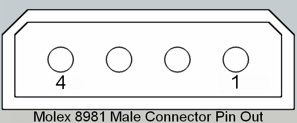

# Prepare a New Internal HDD:

Additional internal hard drives are often necessary for certain computing tasks. Boot drives serve the most essential purpose in a computer, that is, holding the OS besides serving a few casual computing needs. However, a diligent system administrator will always keep work data separate from system data. There are several advantages to storing the operating system on a dedicated small hard drive, such as a solid-state drive (SSD). For example, less data needs to be backed up when reinstalling the OS. For more resource-intensive tasks where drive space is critical, work data can be stored on a separate HDD with a large storage capacity. Conventional magnetic HDDs are often less expensive than SSDs, making them relatively more affordable to expand storage capacity.

Regardless of the operating system, new disks cannot be used immediately. This involves formatting the drive with a suitable filesystem and creating partition tables that are compatible with the operating system on which the drive will be used. This article describes how to prepare new HDDs on a Debian Linux system.


> **Note:** It is important to back up any important data before partitioning and formatting a disk that is not new and contains data. This is because all data on the disk will be erased during this process.

## Table of Contents

* [Prepare a New Internal HDD](#prepare-a-new-internal-hdd)
  * [1. Partition and Alignment](#1-partition-and-alignment)
  * [2. Formatting the usable drive space to EXT4 filesystem using "GNOME Disks"](#2-formatting-the-usable-drive-space-to-EXT4-filesystem-using-gnome-disks)
  * [3. Mount the created ext4 partition](#3-mount-the-created-ext4-partition)
  * [4. Mount the drive at boot](#4-mount-the-drive-at-boot)
  * [5. Add a Bookmark Entry to the File Manager](#5-add-a-bookmark-entry-to-the-file-manager)
  * [6. Creating symlinks](#6-creating-symlinks)
  * [7. Power Supply](#7-power-supply)

A general overview.

## 1. Partition and Alignment.

Instructions on how to partition and align the hard disk drive using `parted`.

---

Ref:

https://www.tecmint.com/create-new-ext4-file-system-partition-in-linux/

Ecosia search: mkpart start and end value

https://unix.stackexchange.com/questions/38164/create-partition-aligned-using-parted

---

**Identify the new disk.** Use the `sudo parted -l` command to list all block devices attached to the system. The commands `sudo fdisk -l` or `lsblk` can also be used. The `fdisk` command lists all block devices connected to the system. The new disk will be listed as a device with a name like `/dev/sdb` or `/dev/sdc` or `/dev/sdX`, where `X` is a letter representing the drive's device node.

```bash
lsblk
```

```bash
sudo parted -l
```

**Create a new partition table on the hard drive.** Use the `parted` command to create a partition table on the new disk. This will involve selecting the type of partition, `primary` or `logical`. Selecting `primary` is a better option for new drives. Note: For most cases, it is recommended to create a single large partition, since EXT4 arranges files in a specific way and a filesystem formatted with EXT4  has little to no tendency to get fragmented.

> MBR partitioning scheme allows you to have up to 4 partitions on a 
> drive, one of those partitions can be an "extended partition", which 
> acts as a container for any number of "logical partitions".
> 
> The partitions which are not inside the extended partition are called "primary partitions", [Ubuntu installation partitioning: Logical or primary? - Ask Ubuntu](https://askubuntu.com/questions/121197/ubuntu-installation-partitioning-logical-or-primary).

Assuming our new disk is a 2TB magnetic HDD,

```bash
sudo parted -a optimal /dev/sdb mkpart primary 32MB 2000GB
```

Or,

```bash
sudo parted -a optimal /dev/sdb mkpart primary 2MB 2000GB
```

The total specified space of a drive cannot be used because filesystems need to create partition tables and structure the drive for storing data. This involves writing specific information to the drive and its partitions, which takes up some space.

We all know that 1GB is equal to 1024MB, but this is not the case for hard disks and USB thumb drives. When buying new disks, keep in mind that manufacturers use the scale of 1GB = 1000MB.

HDDs have data storage ranges, which means that the manufacturers set the start and end of usable space. The exact value of the range can be determined using the `parted` command. The range usually starts at 1024KB and ends at 150MB before the total space specified in the specifications.

For example, a 2TB HDD typically has a start value of 32MB and an end value of 2000GB-150MB. On top of that, consider the space required for the partition tables and the filesystem structures.

**In other words, you cannot use the full capacity of a hard drive because some space is reserved for the partition table and filesystem.**

**Here is an analogy:**

Imagine that you have a new house. The blueprint says that the house has 2,000 square feet of living space. However, you cannot use all of that space because some of it is taken up by walls, hallways, and other non-living areas.

In the same way, some of the space on a hard drive is taken up by the partition table and filesystem. This space is not available for storing your data.

## 2. Formatting the usable drive space to EXT4 filesystem using "GNOME Disks". <a name="2-formatting-the-usable-drive-space-to-EXT4-filesystem-using-gnome-disks"></a>

Instructions on how to format the newly created partition as an EXT4 file system using GNOME Disks.

**Format the partition.** Use the [GNOME Disks](https://apps.gnome.org/en-GB/DiskUtility/) utility to format the partition with a suitable filesystem. For Linux, the most common filesystem is ext4.

Install [GNOME Disks](https://apps.gnome.org/en-GB/DiskUtility/):

```bash
sudo apt update
```

```bash
sudo apt install gnome-disk-utility
```

Add a Name/Label: `hdd` (Can be anything, `aeroplane`/`boat`/`car`/`motorbike`/`tram`).

Format The drive's largest part to EXT4 using [GNOME Disks](https://apps.gnome.org/en-GB/DiskUtility/).

## 3. Mount the created EXT4 partition.

Instructions on how to mount the formatted EXT4 file system so that it can be accessed by the operating system.

Create a mount point before mounting the drive partition.

```bash
sudo mkdir /mnt/hdd
```

**Mount the partition.** Assuming the Device Path is: `/dev/sdb1` (The largest section of the drive `/dev/sdb`), use the `mount` command to mount the partition to a directory (the mount point `/mnt/hdd` in this instance) on the filesystem. This will make the partition accessible to the system.

For example, to mount the new partition at the `/mnt` mount point, you would use the following command:

```bash
sudo mount /dev/sdX1 //mnt
```

Our mount point is `/mnt/hdd`. Thus, the command we will issue is:

```bash
sudo mount /dev/sdb1 //mnt/hdd
```

Use the command given below to list all file systems on your computer. The `-h` flag displays the output in a human-readable format. The flag `-T` denotes the mount points and file system types.

```bash
df -hT
```

## 4. Mount the drive at boot.

Instructions on how to configure the system to automatically mount the drive at boot time.

**Update the `fstab` file.** The `fstab` file tells the system which partitions to mount at boot time. Add an entry for the new partition to the `fstab` file to enable persistent mounting of the drive partition during the boot process.

```bash
sudo nano /etc/fstab
```

Use a GUI plain text editor if you prefer GUI tools over the CLI, `sudo geany /etc/fstab`.

Add the following entry.

> NOTE:

> The 0 and 1 on the last columns referring to and from fstab man pages:
> 
> > **The fifth field (fs_freq).**
> > 
> > This field is used by dump(8) to determine which filesystems need to be dumped. Defaults to zero (don't dump) if
> >  not present.
> > 
> > **The sixth field (fs_passno).**
> > 
> > This field is used by fsck(8) to determine the order in which 
> > filesystem checks are done at boot time. The root
> >  filesystem should be specified with a fs_passno of 1. 
> > Other filesystems should have a fs_passno of 2. Filesystems
> >  within a drive will be checked sequentially, but 
> > filesystems on different drives will be checked at the same time to
> >  utilize parallelism available in the hardware. Defaults
> >  to zero (don't fsck) if not present.
> > 
> > Ref: https://askubuntu.com/questions/707118/what-do-the-fstab-mount-options-errors-remount-ro-mean

```bash
/dev/sdb1   /mnt/hdd  ext4   noatime,errors=remount-ro    0   2
```

Or (for system drives),

```bash
/dev/sdb1   /mnt/hdd  ext4   noatime,errors=remount-ro    0   1
```

**Unmount the new partition if needed.** This is not necessary in general. Still, if you want to unmount the drive for any unforeseeable reason, use the `umount` command. For example, to unmount the partition mounted at `/mnt/hdd`, you would use the following command:

```bash
sudo umount /mnt/hdd
```

Reboot the system to see the changes.

```bash
sudo reboot now
```

Once these steps are completed, the new HDD is ready to use. You can access it at the mount point specified in the `/etc/fstab` file as `/mnt/hdd ext4` in the location `/mnt/hdd`. Enter `/mnt/hdd` and add files.

## 5. Add a Bookmark Entry to the File Manager. <a name="5-add-a-bookmark-entry-to-the-file-manager"></a>

Instructions on how to add a bookmark entry in the file manager for easy access to the mounted drive.

Open your File Manager. Create a bookmark to the folder `/mnt/hdd`.

## 6. Creating symlinks. <a name="6-creating-symlinks"></a>

[How to Create Symbolic Links in Linux [Complete Guide]](https://linuxhandbook.com/symbolic-link-linux/)

The generic syntax:

```bash
ln -s target_dir link_name
```

```bash
ln -s target_file link_name
```

Actual examples:

```bash
ln -s '/mnt/hdd/Photoshop_Masala/stock_photos/' '/home/YOUR_USERNAME/Photoshop_Masala/stock_photos'
```

```bash
ln -s '/mnt/hdd/Videos/stock_footage/' '/home/YOUR_USERNAME/Videos/stock_footage'
```

`ln -s` will create a soft link. `ln` will create a hard link.

However, on Linux systems, creating hard links for directories is not allowed.

## 7. Power Supply. <a name="7-power-supply"></a>

Choose a proper SATA power connector whenever possible. MOLEX to SATA power converters might not work in some cases if the drive requires a dedicated 3.3v power rail.

Here's the PINOUT diagram of a SATA power connector:

Ref:

[15-Pin SATA Power Connector Pinout](https://www.lifewire.com/sata-15-pin-power-connector-pinout-2624584)


15, 14, ..., 1

| Pin | Name    | Color  | Description                    |
| --- | ------- | ------ | ------------------------------ |
|     |         |        |                                |
| 1   | +3.3VDC | Orange | +3.3 VDC                       |
| 2   | +3.3VDC | Orange | +3.3 VDC                       |
| 3   | +3.3VDC | Orange | +3.3 VDC                       |
| 4   | COM     | Black  | Ground                         |
| 5   | COM     | Black  | Ground                         |
| 6   | COM     | Black  | Ground                         |
| 7   | +5VDC   | Red    | +5 VDC                         |
| 8   | +5VDC   | Red    | +5 VDC                         |
| 9   | +5VDC   | Red    | +5 VDC                         |
| 10  | COM     | Black  | Ground                         |
| 11  | COM     | Black  | Ground (Optional or other use) |
| 12  | COM     | Black  | Ground                         |
| 13  | +12VDC  | Yellow | +12 VDC                        |
| 14  | +12VDC  | Yellow | +12 VDC                        |
| 15  | +12VDC  | Yellow | +12 VDC                        |

The following is the PINOUT Diagram of MOLEX power connectors.

Ref: [Molex connector - Wikipedia](https://en.wikipedia.org/wiki/Molex_connector)



4, ..., 1

| Male pins (female connector) |           |          |
| ---------------------------- | --------- | -------- |
| Pin                          | **Color** | **Type** |
| Pin 1                        | Yellow    | +12 V    |
| Pin 2                        | Black     | Ground   |
| Pin 3                        | Black     | Ground   |
| Pin 4                        | Red       | +5 V     |


[A MOLEX to SATA power converter]

Whenever possible, use a proper SATA power connector instead of a MOLEX to SATA power converter. MOLEX to SATA power converters may not work for some drives, especially newer SSDs and most magnetic HDDs, because by nature, a MOLEX power connector does not provide the required 3.3v power rail.

Even if a MOLEX to SATA power converter does work, it is often made of poor-quality materials. The plastic sockets may not attach to the PSU's MOLEX connectors properly, and the plastic in the converter may melt when attached to high-speed SSDs that consume a lot of power. Newer SSDs require a dedicated 3.3v power rail as well. Those new SSDs will not work with such converters from the beginning.

**Here is a summary of the risks of using MOLEX to SATA power converters:**

- **They may not work for all drives, especially newer SSDs and most magnetic HDDs.**
- **They are often made of poor-quality materials.**
- **The plastic sockets may not attach to the PSU's MOLEX connectors properly.**
- **The plastic in the converter may melt when attached to high-speed SSDs that consume a lot of power.**

**Therefore, it is best to use a proper SATA power connector whenever possible.**
