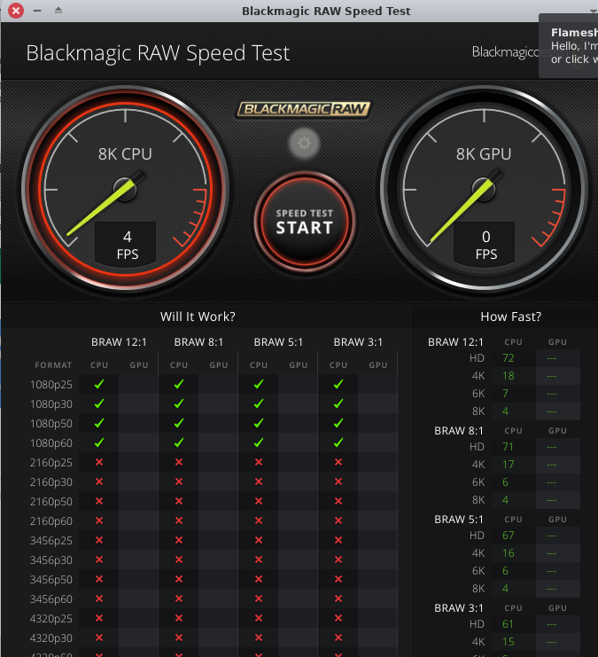

# Working with RED R3D Camera footage and Blackmagic RAW files.

## RED R3D

**WARNING:**

---

Before executing the REDline installer script, it is recommended to run it within a virtual machine (VM) or take a backup of all data and the system using 'TimeShift'. Please note that it is advised to create a snapshot of the VM prior to running the script if you are testing the script within a VM. If the program works as expected without causing any issues with the OS in the test environment, the program can then be safely installed in the production environment. Unfortunately, upon installing REDline, the PulseAudio System Tray Plugin ceased to function and was automatically removed from the XFCE panel. As a result, MP3 and other audio files could not be played with any player application. Video editors typically anticipate an AppImage binary blob when working with proprietary software; however, this does not apply to RED Red Digital Cinema Camera Systems.

---

https://video.stackexchange.com/questions/12830/how-to-work-with-r3d-and-rmd-files-ffmpeg

Ans. 1:

> R3D files are essentially just a custom container that holds video encoded in JPEG2000 and PCM audio. Though ffmpeg only supports the RED container until version 3, not the newer version 4 (see this).
> 
> You can convert RED version **3** files the same way you 
> would convert any other video with ffmpeg.
> F.e. to h264 use the command below. Doesn't make much sense though to 
> use h264 for further editing, you will have to use an intermediate codec
>  and or container that your software supports:
> 
> ```bash
> ffmpeg -i input.r3d -vcodec libx264 -preset slow output.mp4
> ```

Ans. 2:

> You can use red official program "REDline" Download It from here https://www.red.com/download/redline-linux-beta

> It's a shell script. to install it. From properties change it's permission to allow execute.

> chmod +x REDline_Build_60.52530_Installer.sh
> sudo ./REDline_Build_60.52530_Installer.sh

> normally you can convert R3D (red video files to other formats like openexr,tiff , jpeg ) files to image sequences and also you extract audio too.

> Now if i want to convert a R3D files to jpeg sequences the command would be like this

> $ REDline -i <filelocation/file.R3D> --format 3 -o filename

> let me explain what are these commands and options are

> here REDline is our program for converting R3D files to image sequences

> -i means video for converting

> --format 3 means convert to what format currently the program supports DPX , Tiff, OpenEXR , JPEG, SGI, R3D Trim, Apple ProRes and Avid DNX formats. now what does 3 means 3 means convert R3D files to image sequences. so how can you convert to Tiff format use number 1. for other formats you can use

> DPX = 0, OpenEXR = 2, SGI = 4, R3D Trim = 102, Apple ProRes=201, Avid DNX = 204

> -o means output file name because you are converting to jpeg image sequences the program will automatically name it.like wise

> filename.000000.jpg
> filename.000001.jpg
> filename.000002.jpg
> filename.000003.jpg

**NOTE:** Give FFMPEG a try before installing any software provided by camera manufacturers.

Download REDline: https://www.red.com/download/redline-linux-beta

Dependencies:

LSB support:

```bash
sudo apt install lsb-release
```

```bash
chmod +x REDline_Build_60.52530_Installer.sh
```

```bash
sudo ./REDline_Build_60.52530_Installer.sh
```

```bash
REDline -i <filelocation/file.R3D> --format 3 -o filename
```

The conversion process of a sample RED Raptor 8K S35 ARRIRAW file into a JPEG sequence utilising the REDline command-line program has been executed within a virtual machine (VM).

To access the sample RED file, please visit <https://www.red.com/download/sample-r3d-file-v-raptor-8k-s35-geese>. 

Information about RED Cinema Camera Systems can be obtained through their official website at <https://www.red.com/>.

Instructions for creating a Debian VM with minimal packages can be found within the folder `Debian-minimal/virtual_machines`. It is recommended to install a lightweight graphical user interface (GUI), such as a tiling window manager or a lightweight desktop environment like IceWM, if necessary. Please note that audio and FFMPEG components will not be required during the conversion process.

```bash
mkdir outputfolder
```

```bash
REDline -i A001_C007_1214NS_001.R3D --format 3 -o outputfolder/outputfile
```

Upon successful execution of the program, it produced a series of JPEG images and deposited them within the designated `outputfolder`.

```
outputfile.000000.jpg
...
outputfile.000009.jpg
...
```

During the conversion process, each JPEG output file consumed approximately 15.7 megabytes of storage. The conversion operation proved to be sluggish on my 4th-generation Dual Core Pentium Gold computer, necessitating up to ten seconds per file to complete the processing task. Occasionally, the conversion procedure would take longer than thirty seconds to execute per frame.

```
 usern  /mnt/hdd/Downloads/Arri_RED/v-raptor-8k-s35-geese/v-raptor-8k-s35-geese/A001_C007_1214NS.RDC/outputfolder
 exiftool outputfile.000000.jpg
ExifTool Version Number         : 12.57
File Name                       : outputfile.000000.jpg
Directory                       : .
File Size                       : 17 MB
File Modification Date/Time     : 2023:11:07 18:25:54+05:30
File Access Date/Time           : 2023:11:07 18:25:51+05:30
File Inode Change Date/Time     : 2023:11:07 18:25:54+05:30
File Permissions                : -rw-r--r--
File Type                       : JPEG
File Type Extension             : jpg
MIME Type                       : image/jpeg
JFIF Version                    : 1.01
Resolution Unit                 : None
X Resolution                    : 1
Y Resolution                    : 1
Image Width                     : 8192
Image Height                    : 4320
Encoding Process                : Baseline DCT, Huffman coding
Bits Per Sample                 : 8
Color Components                : 3
Y Cb Cr Sub Sampling            : YCbCr4:2:0 (2 2)
Image Size                      : 8192x4320
Megapixels                      : 35.4
 usern  /mnt/hdd/Downloads/Arri_RED/v-raptor-8k-s35-geese/v-raptor-8k-s35-geese/A001_C007_1214NS.RDC/outputfolder   
```

```
Computer
********


Summary
-------

-Computer-
Processor        : Intel(R) Pentium(R) CPU G3240 @ 3.10GHz
Memory        : 5509MB (2074MB used)
Machine Type        : Desktop
Operating System        : Debian GNU/Linux 12 (bookworm)
User Name        : usern (UserN)
Date/Time        : Tuesday 07 November 2023 06:38:25 PM
-Display-
Resolution        : 1368x768 pixels
OpenGL Renderer        : llvmpipe (LLVM 15.0.6, 128 bits)
X11 Vendor        : The X.Org Foundation
-Audio Devices-
Audio Adapter        : HDA-Intel - HDA Intel PCH
-Input Devices-
 AT Translated Set 2 keyboard
 Power Button
 Power Button
 USB OPTICAL MOUSE
 PC Speaker
 HDA Digital PCBeep
 HDA Intel PCH Rear Mic
 HDA Intel PCH Front Mic
 HDA Intel PCH Line
 HDA Intel PCH Line Out
-Printers (CUPS)-
Ink-Tank-310-series        : <i>Default</i>
RICOH_SP_111_DDST

Operating System
----------------

-Version-
Kernel        : Linux 6.1.0-13-amd64 (x86_64)
Version        : #1 SMP PREEMPT_DYNAMIC Debian 6.1.55-1 (2023-09-29)
C Library        : GNU C Library / (Debian GLIBC 2.36-9+deb12u3) 2.36
Distribution        : Debian GNU/Linux 12 (bookworm)
-Current Session-
Computer Name        : debian-appu
User Name        : appu (Appu)
Language        : en_IN (en_IN:en)
Home Directory        : /home/appu
-Misc-
Uptime        : 33 minutes
Load Average        : 0.49, 0.70, 0.90
Available entropy in /dev/random        : 256 bits (medium)
```

## Arri:

ARRIRAW HDE Transcoder for ALEXA 35: https://www.arri.com/en/learn-help/learn-help-camera-system/tools/arriraw-hde-transcoder

ARRIRAW Converter (ARC) (Legacy): https://www.arri.com/en/learn-help/learn-help-camera-system/tools/legacy-software/arriraw-converter

ARC_CMD does not support ALEXA 35, please refer to [ARRI Reference Tool (ART)](https://www.arri.com/en/learn-help/learn-help-camera-system/tools/arri-reference-tool) for viewing, rendering, look file creation, or metadata extraction with ALEXA 35.

ARRI Reference Tool (ART) (Linux version not available): https://www.arri.com/en/learn-help/learn-help-camera-system/tools/arri-reference-tool

Additional samples of camera footage (demo shots and reference images for workflow tests) can be found at https://www.arri.com/en/learn-help/learn-help-camera-system/camera-sample-footage-reference-image.

Credentials for the media server to download the files:

```
FTP Access
For ALEXA clips:
Server:   ftp2.arri.de
User:     ALEXA
Password: samplefootage
```

ARRIRAW Converter 4.3.0.0 (CMD) User Manual 03 August 2020: https://www.arri.com/resource/blob/211638/6e13a58cfae667f031fee253aaaba9c1/arriraw-converter-cmd-4-3-0-manual-data.pdf

ARRIRAW FAQ: https://www.arri.com/en/learn-help/learn-help-camera-system/pre-postproduction/file-formats-data-handling/arriraw-faq

Install dependencies:

https://www.arri.com/en/learn-help/learn-help-camera-system/tools/legacy-software/arriraw-converter

https://superuser.com/questions/1281454/error-while-loading-shared-libraries-libopencl-so-1-cannot-open-shared-object

```bash
sudo apt install ocl-icd-opencl-dev
```

Download the `arriraw_hde_centos_10868_20230722.tar.gz` and `ARRIRAW_Converter_CMD_4.4.0_Centos_8.zip` files from the provided links. Extracting these files will result in the production of the binary `arrirawhde` and the `ARRIRAW_Converter_CMD_4.4.0_Centos_8` folder. Within the folder, you will discover the following binaries: `ARC_CMD` and `shortsettings.xml`.

```
ARRIRAW_Converter_CMD_4.4.0_Centos_8/bin/
                                         ARC_CMD
                                         shortsettings.xml
```

To install the programs, issue the following commands:

For Arri RAW HDE:

```bash
chmod -m +x arrirawhde && mv arrirawhde $HOME/.local/bin
```

For ARC_CMD:

```bash
chmod -m +x ARC_CMD && mv ARC_CMD $HOME/.local/bin
```

Additionally, copy the `shortsettings.xml` file to the same directory where the Arri program binaries are installed.

```bash
cp shortsettings.xml $HOME/.local/bin
```

Regrettably, despite attempting to use this software, I encountered difficulties in decoding the Arri RAW media stream. As a consequence, the conversion process failed.

## Blackmagic RAW:

https://www.blackmagicdesign.com/event/blackmagicrawinstaller

Download the file `Blackmagic_RAW_Linux_3.4.tar.tar`. After extracting the archive you will find two files, `blackmagic-raw-3.4.x86_64.rpm` and `BlackmagicRAW_3.4.tar.gz`. `BlackmagicRAW_3.4.tar.gz` contains a speed test application for testing the playback performance of Blackmagic BRAW files and a BRAW player. Unlike QuickTime Player for Microsoft Windows, the Blackmagic player app cannot convert BRAW files to other formats. However, they provide an SDK with some shared libraries and a C++ header. To get the SDK, you will have to extract the RPM package.



There's also an open-source video converter available on GitHub, [AkBKukU/braw-decode: BRAW decoder to allow unattended, headless, conversion of *.braw files into other file formats.](https://github.com/AkBKukU/braw-decode). However, the 'braw-decode' app could not read the BRAW file.

---

You can reach out to [Fastvideo LLC](https://www.fastcinemadng.com/contacts/contacts.html) for their Linux version of media converter [Fast CinemaDNG Processor download for Windows and Linux](https://www.fastcinemadng.com/download/download.html). They provide a Ubuntu DEB package upon request which you can extract and adjust for your distribution later. Download their app and convert it to a suitable format using `alien` package converter.

[How to Convert .rpm package to .deb using alien Package Converter? - GeeksforGeeks](https://www.geeksforgeeks.org/how-to-convert-rpm-package-to-deb-using-alien-package-converter/)

https://ostechnix.com/convert-linux-packages-alien/

```bash
sudo apt install alien
```

Package conversion can be performed by issuing a command like this:

```bash
sudo alien --to-tgz --scripts package.deb/rpm
```

Example:

```bash
sudo alien --to-tgz --scripts blackmagic-raw-3.4.x86_64.rpm
```

---

One efficient method for converting BRAW files or any other RAW data is to install compatible software within a Windows Guest VM and transform the RAW camera files into a format that FFMPEG can process. It is essential to allocate all system resources to the VM, including GPU/CPU passthrough, VM nesting, and so forth. Many contemporary virtual machine management programs offer these features, such as QEMU/KVM/GNOME Boxes/Red Hat Virtual Machine Manager (virt-manager)/Oracle VM VirtualBox/VMware Workstation, among others.

When selecting a camera model, it is crucial to verify if it has options for recording in DPX, CinemaDNG, ProRes, DNxHD, or similar formats that are compatible with FFMPEG. If possible, change the recording settings in the camera and attempt to convert sample footage from the camera using FFMPEG prior to capturing any shots. This step ensures compatibility between the camera output and the desired editing software.

****

**AppImage - AppImage - AppImage** 

****

Another viable solution would be to encourage camera manufacturers to supply AppImage files or statically linked binaries as command-line media conversion tools on various platforms. The use of script automation for media file conversions is prevalent in the industry. While some newcomers to Linux may inadvertently believe that AppImage packages are exclusively all about graphical user interfaces, this is not entirely accurate. AppImage files can function as both command-line utilities and GUI applications. To address the compatibility issue, camera manufacturers should either abandon their reliance on proprietary codecs and platform-specific software or provide a statically linked, self-contained AppImage package for Linux and equivalent binary blobs for all significant platforms and architectures. For reference, please refer to the discussion thread "Edit .braw files in Kdenlive - Help - KDE Discuss" at https://discuss.kde.org/t/edit-braw-files-in-kdenlive/4751 .

---

Blackmagic Design's DaVinci Resolve offers support for a wide range of codecs for opening diverse media formats on Linux systems. After converting the footage within Resolve to a codec format suitable for reading with FFMPEG, users can proceed to edit the transformed files in their preferred video editing software.

---

To obtain further details regarding JPEG codecs, kindly refer to the provided links below.

https://www.fastcompression.com/blog/jpeg-j2k-png-review.htm

https://www.lapseoftheshutter.com/jpeg-vs-jpeg2000/
