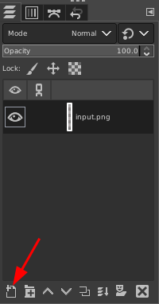

**Step-by-Step Guide:**

**Generate Blank SVG:** Execute the script without arguments to produce a blank SVG template file.

**Design Titles in Inkscape:** Import the SVG file into Inkscape and unleash your creativity by incorporating eye-catching texts with diverse fonts, colours, styles, vectors, and sizes.

**Export from Inkscape:** Navigate to File Menu > Export (CTRL+SHIFT+e) in Inkscape. Under the Export Tab, select 'Single Image' > 'Page'. Choose a destination and export the file.

Prepare the Matte in GIMP: Launch GIMP and import the PNG file exported from Inkscape.

Right-click on the Layers Panel and select 'Alpha to Selection'.

Invert the selection (Menu > Invert, CTRL+i).

Disable the input PNG layer (click the Eye Icon).

Create a new layer (Layer Menu > New Layer, SHIFT+CTRL+n or click the 'New' icon in the layer panel).

Utilise the Bucket Fill Tool (SHIFT+b) to fill the new layer with a solid black colour. Delete the original input layer.

Export the matte as a JPEG file (File Menu > Export As, CTRL+SHIFT+e). Append '-m' to the filename and proceed with the export.

If needed, add two pixels of motion blur to both the title image and the matte file.

Generate Videos: Run the script with the command ./ff_scroller.c input.png input-m.jpg. The program will generate two video files: one containing the title and the other containing the mask/matte information.

1. A grayscale output video containing the alpha channel information (from your JPG file containing the grayscale mask/matte)
2. A scrolling video with the colour and the text (from your PNG file containing the coloured title)

**Choose Your Output Format:** Combine the two video files or use the single-file premultiplied alpha option. You can either combine the two separate video files, one with the title and the other containing the mask/matte information or use the single-file premultiplied alpha option, depending on your NLE preferences.

